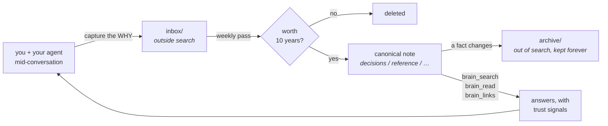
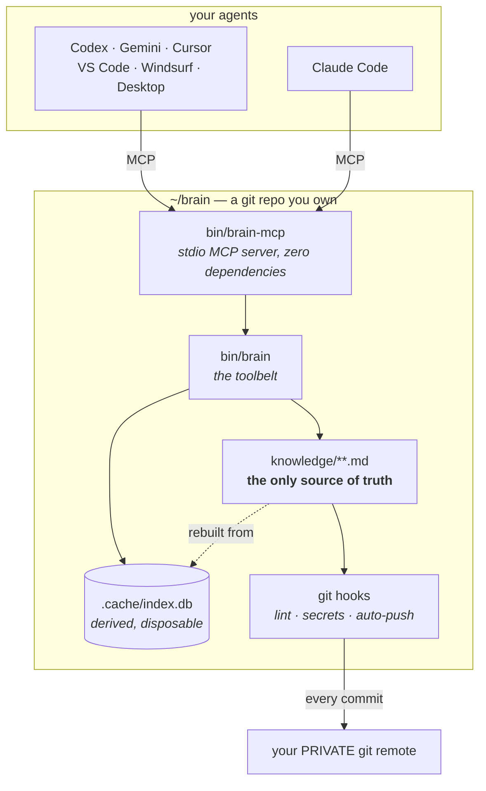

<!-- Replace with docs/assets/hero-*.svg once generated — see docs/assets/BRIEFS.md (B2) -->
<h1>brain</h1>

**A second brain that stays true.** Your knowledge as plain markdown in a git
repo you own, wired so any MCP-capable agent can search it, read it, and add to
it — and built to stay *accurate* as it gets large, not just to get large.

Works with Claude Code, OpenAI Codex CLI, Gemini CLI, Cursor, VS Code + Copilot,
Windsurf, and Claude Desktop. macOS, Linux and Windows.

---

## The problem this exists for

<!-- Replace with docs/assets/concept-decay-*.svg once generated — BRIEFS.md (B4) -->

Note-taking systems do not fail by losing notes. They fail by **filling up**.
Year one, everything in there is true and you trust all of it. Year three, most
of it is stale, some of it is wrong, and nothing about a note tells you which
kind you are reading. So you stop trusting the pile, and a system you do not
trust is one you stop consulting — which is the same as not having it.

Handing that pile to an AI makes it worse, not better: the model answers
confidently from whichever note it happened to retrieve, including the one you
superseded eighteen months ago.

So most of this system is not storage. It is machinery for keeping knowledge
true as it grows.

## The loop



The capture step is the one people skip, and it is the one that matters. The
*what* is recoverable from git, files and calendars. The **why** — the
alternative you rejected, the constraint you discovered, the root cause that
cost you a day — evaporates within a week. That is what this captures.

## How it is put together



Two properties do most of the work. **The markdown files are the only truth** —
every index is derived and can be deleted at any time. And **the tool layer is
vendor-neutral**: `bin/brain-mcp` is a stdio MCP server with no vendor SDK, so
switching models or agents loses nothing.

## Install

Two commands. The first gives you a working, backed-up brain; the second lets
your agents reach it. Each ends in a working state, so stopping after either
one is a legitimate place to stop.

**macOS and Linux**

```sh
curl -fsSL https://raw.githubusercontent.com/Cazy00/brain/main/install.sh | sh
```

**Windows** (PowerShell)

```powershell
irm https://raw.githubusercontent.com/Cazy00/brain/main/install.ps1 | iex
```

Both do the same thing: check git and Python, fetch the template, and hand off
to `brain setup`, which asks where the brain should live, gives it a git history
that is **yours**, creates your **private** GitHub repo, and proves the result
with `doctor`. Setup's exit code is doctor's, so an install it calls done is one
the health check agrees with. Prefer to read it first? It is
[one file](install.sh), and under 120 lines.

Then, from the new brain:

```sh
brain connect                     # what this machine is wired to
brain connect --all --apply       # register the server with every client found
brain connect --routing --apply   # the rule that makes agents reach for it
```

Only using this on one computer? That is everything. Reaching it from other
devices is a separate, optional step — `brain serve`, and
[SETUP.md](SETUP.md) Part 8.

### Prerequisites

Nothing is ever installed for you. Setup prints the exact command and what you
lose by skipping it.

| | | Without it |
|---|---|---|
| `git` | **required** | Nothing works — the brain *is* a git repository |
| `python3` ≥ 3.9 | **required** | The toolbelt and the MCP server are Python |
| `gh` | optional | No automatic private backup; you create the GitHub repo yourself |
| `gitleaks` | optional | The secret gate falls back to the built-in scanner alone |
| `age` | optional | No encrypted vault for sensitive notes |
| `rg` | optional | Search still works; the plain-grep tier is slower |

### Handing this to an agent

The whole install is scriptable, and setup speaks JSON for exactly this reason:

> Install the brain from https://github.com/Cazy00/brain — run its install
> script, then `bin/brain setup --json --yes`, then `bin/brain connect --all
> --apply` and `bin/brain connect --routing --apply`. Report the JSON.

**Claude Code users** can also install the plugin:

```
/plugin marketplace add Cazy00/brain
/plugin install brain@cazy00
```

The plugin is wiring only — it registers the MCP server and ships the `/brain`
skill, pointing at whatever brain repo you already have. Your notes never live
in the plugin directory.

Full guide, including schedules, the encrypted vault and a second machine:
**[SETUP.md](SETUP.md)**. The rules notes are held to: **[AGENTS.md](AGENTS.md)**.

## How it stays true

| Mechanism | What it prevents |
|---|---|
| **Supersede protocol** | Outdated notes get `status: superseded` and physically **move out of the search scope**. Being wrong requires effort, not vigilance. |
| **A commit gate that blocks** | Schema violations, secrets, dangling `[[links]]`, duplicate ids and half-finished supersedes are refused at `git commit`, and again in CI. |
| **Generous capture, strict promotion** | Quick thoughts land in `inbox/`, outside default search. A weekly pass promotes the few that earn it and deletes the rest. |
| **A validated link graph** | A `[[wikilink]]` to a note that does not exist fails the build. Links rot loudly instead of quietly. |
| **Trust signals on every read** | `[provisional — unconsolidated]`, an ARCHIVED banner, a passed `review_by` — retrieval tells you how much to trust what it just handed you. |
| **`brain stats`** | Measures the things that fail *silently*: findability, capture rate, staleness, curation, orphans. |

## Knowing it still works

`doctor` tells you the machinery is wired. `stats` tells you the **knowledge** is
still healthy — the failures that are silent:

```
$ brain stats

  corpus     412 current note(s)
  capture    6 added in 7d, 31 in 30d, 96 in 90d
  findable   [ok ] 412/412 notes are returned by a search for their own title (100%)
  freshness  180/412 carry a review_by date
  curation   last consolidation: 2026-07-19
```

The headline is **findability**: every note is searched for by its own title and
must come back. It is the weakest query that has to work — if that misses,
nothing you type will do better. `--record` appends a tracked history line, so
the trend survives a re-clone.

`brain connect` answers the other half of the question: not whether the brain is
healthy, but whether your agents are pointed at **this** one. A second clone, or
a brain that moved, leaves an agent talking to a path that is not this one, and
every tool call still succeeds — against nothing.

## Your brain is a git repository

That is the point: permanent, versioned, yours. Two consequences you have to
accept:

- **Every commit auto-pushes.** A hook pushes to your remote in the background.
  That is the backup, and it makes a lost laptop a non-event.
- **So the remote holds everything you ever record — it must be private.**

A brain in a public repo is every private thought you wrote down, world-readable,
in a history that outlives deleting it. So `bin/brain doctor` checks on every run
and fails loudly if your remote is publicly readable:

```
[RED] YOUR BRAIN IS PUBLIC — anyone on the internet can read every note in it.
       Fix it now:  gh repo edit <you>/my-brain --visibility private …
```

GitHub is the default because it is where most people are; any git remote works.
Running with **no remote** is supported — everything works except the backup —
but it is not a state this system will call finished: `doctor` reports it red
every time, and so does `brain setup --no-repo`, on purpose.

## What it deliberately does not do

Listed because a second brain that oversells itself is exactly the kind you stop
trusting.

- **No semantic search.** Retrieval is lexical plus structure (SQLite FTS5, BM25
  over title/aliases/topics/body, folder-weighted, plus the link graph). If your
  words differ completely from the note's words, it can miss where an
  embeddings system would not. Deferred on purpose.
- **No contradiction detection between two current notes.** The system fights
  staleness structurally — supersede, `review_by`, link validation — but nothing
  automatically notices that two live notes disagree.
- **One consolidator, pinned.** Any agent can search, read and capture; the
  weekly curation pass runs on exactly one named agent and model. Retrieval is
  deterministic code and identical everywhere, so the only model-dependent
  judgement — what becomes permanent — is not left to whatever happens to be
  running.
- **Client indexes are not trusted.** Several agents ship a semantic codebase
  search that ignores this repo's ignore rules and would return superseded and
  unconsolidated notes as current, stripped of their trust signals. Retrieval
  goes through the brain's own tools.
- **Remote access is opt-in, and takes two kinds of credential.** `brain serve`
  puts the same tools on HTTP behind a token you mint, refuses to start without
  one, binds loopback unless told otherwise, and backs off after repeated failed
  authentication. That covers every client that can set a request header —
  Claude Code, Codex CLI, Cursor, VS Code. `--oauth --public-url <url>` adds an
  OAuth 2.1 authorization server beside it, for **hosted** assistants that never
  see a config file and can only hold a credential a person consented to in a
  browser. It is built to the MCP authorization specification rather than to any
  one vendor — PKCE, protected-resource and authorization-server metadata,
  Client ID Metadata Documents, audience-bound opaque tokens, rotation — so any
  client speaking that spec works, and there is no per-provider code anywhere.
  Both credentials work on the same URL at the same time; the header path is
  unchanged. Dynamic client registration is deliberately absent (the MCP spec
  deprecates it); `serve --new-client` covers anything that needs a client id.
  See [`setup/runbooks/remote-oauth.md`](setup/runbooks/remote-oauth.md), which
  is honest about the two things in it that have not been verified.
  `--read-only` serves the four read tools and refuses `brain_capture`,
  which limits what a holder of the token can *change* — every note is still
  readable. Read-only is a property of the process; a `brain:read` OAuth token
  is the same question asked of one credential rather than one server.
- **The server records what happens, and cannot record what you asked it.**
  `brain logs` shows failed authentication, refused requests, tool errors and
  every step of an OAuth handshake. It holds no query text, no note content and
  no credential — by construction rather than by filtering: the log accepts only
  field names and values from fixed vocabularies, so caller-supplied text cannot
  reach it at all. It lives outside the repository, so it cannot reach git.
- **The privacy rule is instruction-enforced.** "Ask before recording anything
  about a person's private life" is followed by the model, not enforced by code,
  and commits auto-push. Weaker harnesses will eventually get this wrong.
- **Windows is verified by CI only.** The test suite runs on all three
  platforms; nobody on this project owns a Windows machine, so anything CI
  cannot reach there — how the path picker feels in a real terminal, Credential
  Manager prompts — is unverified rather than known to work.
- **A published brain protects the notes you left out of it, and nothing
  else.** `brain publish` compiles a second brain (P) holding only notes a
  human approved, so an agent you do not trust can be pointed at P and there is
  no prompt that gets it the rest — they are not there to get. What it does not
  do: stop a cheap model saying something wrong about what IS in P, or make
  anything in P confidential. Curate P as a public web page, because
  functionally it is one. The isolation is process and credential separation,
  which is why it survives a weak model —
  [`setup/runbooks/business-partition.md`](setup/runbooks/business-partition.md)
  has the checklist that proves it on your own hosts.
- **Not all of it is tested.** 585 runtime tests cover the toolbelt
  (`python3 -m unittest discover -s tests`). `schedule` and the vault flow are
  exercised by hand.

## Where things are

| | |
|---|---|
| [SETUP.md](SETUP.md) | The complete guide: install, wiring, schedules, vault, second machine, troubleshooting |
| [AGENTS.md](AGENTS.md) | The protocol: note contract, capture policy, search tiers, supersede |
| [setup/runbooks/business-partition.md](setup/runbooks/business-partition.md) | Two brains: the one you keep, and the one a customer-facing agent may read |
| [docs/assets/BRIEFS.md](docs/assets/BRIEFS.md) | Visual asset specifications |
| `bin/brain --help` | Every command |

## License

MIT — see [LICENSE](LICENSE).
