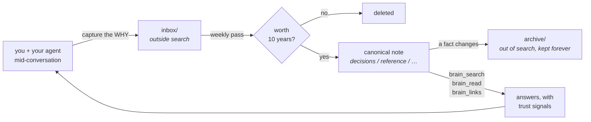
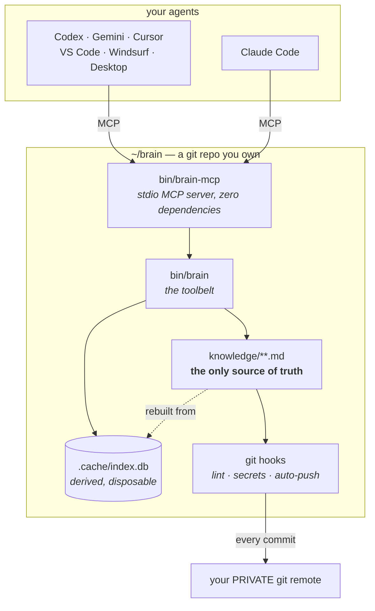

<!-- Replace with docs/assets/hero-*.svg once generated — see docs/assets/BRIEFS.md (B2) -->
<h1>brain</h1>

**A second brain that stays true.** Your knowledge as plain markdown in a git
repo you own, wired so any MCP-capable agent can search it, read it, and add to
it — and built to stay *accurate* as it gets large, not just to get large.

```sh
curl -fsSL https://raw.githubusercontent.com/Cazy00/brain/main/install.sh | sh
```

Works with Claude Code, OpenAI Codex CLI, Gemini CLI, Cursor, VS Code + Copilot,
Windsurf, and Claude Desktop. macOS today; the core is portable Python and runs
on Linux with two DIY pieces ([SETUP.md](SETUP.md)).

---

## The problem this exists for

<!-- Replace with docs/assets/concept-decay-*.svg once generated — BRIEFS.md (B4) -->

Note-taking systems do not fail by losing notes. They fail by **filling up**.
Year one, everything in there is true and you trust all of it. Year three, most
of it is stale, some of it is wrong, and nothing about a note tells you which
kind you are reading. So you stop trusting the pile, and a system you do not
trust is one you stop consulting — which is the same as not having it.

Handing that pile to an AI makes it worse, not better: the model answers
confidently from whichever note it happened to retrieve, including the one you
superseded eighteen months ago.

So most of this system is not storage. It is machinery for keeping knowledge
true as it grows.

## How it stays true

| Mechanism | What it prevents |
|---|---|
| **Supersede protocol** | Outdated notes get `status: superseded` and physically **move out of the search scope**. Being wrong requires effort, not vigilance. |
| **A commit gate that blocks** | Schema violations, secrets, dangling `[[links]]`, duplicate ids and half-finished supersedes are refused at `git commit`, and again in CI. |
| **Generous capture, strict promotion** | Quick thoughts land in `inbox/`, outside default search. A weekly pass promotes the few that earn it and deletes the rest. |
| **A validated link graph** | A `[[wikilink]]` to a note that does not exist fails the build. Links rot loudly instead of quietly. |
| **Trust signals on every read** | `[provisional — unconsolidated]`, an ARCHIVED banner, a passed `review_by` — retrieval tells you how much to trust what it just handed you. |
| **`brain stats`** | Measures the things that fail *silently*: findability, capture rate, staleness, curation, orphans. |

## The loop



The capture step is the one people skip, and it is the one that matters. The
*what* is recoverable from git, files and calendars. The **why** — the
alternative you rejected, the constraint you discovered, the root cause that
cost you a day — evaporates within a week. That is what this captures.

## How it is put together



Two properties do most of the work. **The markdown files are the only truth** —
every index is derived and can be deleted at any time. And **the tool layer is
vendor-neutral**: `bin/brain-mcp` is a stdio MCP server with no vendor SDK, so
switching models or agents loses nothing.

## Git and GitHub — read this before you start

Your brain **is a git repository**, and that is the point: permanent, versioned,
yours. Two consequences you have to accept:

- **Every commit auto-pushes.** A hook pushes to your remote in the background.
  That is the backup, and it makes a lost laptop a non-event.
- **So the remote holds everything you ever record — it must be private.**

A brain in a public repo is every private thought you wrote down, world-readable,
in a history that outlives deleting it. So `bin/brain doctor` checks on every run
and fails loudly if your remote is publicly readable:

```
[RED] YOUR BRAIN IS PUBLIC — anyone on the internet can read every note in it.
       Fix it now:  gh repo edit <you>/my-brain --visibility private …
```

GitHub is the default because it is where most people are; any git remote works.
Running with **no remote** is supported too — everything works except the backup,
and doctor will remind you, every time, that your knowledge exists on one machine.

## Knowing it still works

`doctor` tells you the machinery is wired. `stats` tells you the **knowledge** is
still healthy — the failures that are silent:

```
$ brain stats

  corpus     412 current note(s)
  capture    6 added in 7d, 31 in 30d, 96 in 90d
  findable   [ok ] 412/412 notes are returned by a search for their own title (100%)
  freshness  180/412 carry a review_by date
  curation   last consolidation: 2026-07-19
```

The headline is **findability**: every note is searched for by its own title and
must come back. It is the weakest query that has to work — if that misses,
nothing you type will do better. `--record` appends a tracked history line, so
the trend survives a re-clone.

## Install

```sh
curl -fsSL https://raw.githubusercontent.com/Cazy00/brain/main/install.sh | sh
```

Checks prerequisites, installs into `~/brain`, gives the clone a fresh git
history that is **yours**, offers to create your **private** repo, wires this
machine, and proves it with `doctor`. It refuses to install over a non-empty
directory. Prefer to read it first? It is [one file](install.sh).

**Claude Code users** can also install the plugin:

```
/plugin marketplace add Cazy00/brain
/plugin install brain@cazy00
```

The plugin is wiring only — it registers the MCP server and ships the `/brain`
skill, pointing at whatever brain repo you already have. Your notes never live
in the plugin directory.

Full guide, including other agents, schedules and the encrypted vault:
**[SETUP.md](SETUP.md)**. The rules notes are held to: **[AGENTS.md](AGENTS.md)**.

## What it deliberately does not do

Listed because a second brain that oversells itself is exactly the kind you stop
trusting.

- **No semantic search.** Retrieval is lexical plus structure (SQLite FTS5, BM25
  over title/aliases/topics/body, folder-weighted, plus the link graph). If your
  words differ completely from the note's words, it can miss where an
  embeddings system would not. Deferred on purpose.
- **No contradiction detection between two current notes.** The system fights
  staleness structurally — supersede, `review_by`, link validation — but nothing
  automatically notices that two live notes disagree.
- **One consolidator, pinned.** Any agent can search, read and capture; the
  weekly curation pass runs on exactly one named agent and model. Retrieval is
  deterministic code and identical everywhere, so the only model-dependent
  judgement — what becomes permanent — is not left to whatever happens to be
  running.
- **Client indexes are not trusted.** Several agents ship a semantic codebase
  search that ignores this repo's ignore rules and would return superseded and
  unconsolidated notes as current, stripped of their trust signals. Retrieval
  goes through the brain's own tools.
- **Local only.** No web or mobile — the MCP server runs on your machine.
- **The privacy rule is instruction-enforced.** "Ask before recording anything
  about a person's private life" is followed by the model, not enforced by code,
  and commits auto-push. Weaker harnesses will eventually get this wrong.
- **Not all of it is tested.** 209 runtime tests cover the toolbelt
  (`python3 -m unittest discover -s tests`). `schedule` and the vault flow are
  exercised by hand.

## Where things are

| | |
|---|---|
| [SETUP.md](SETUP.md) | Install, wire every agent, schedules, vault, troubleshooting |
| [AGENTS.md](AGENTS.md) | The protocol: note contract, capture policy, search tiers, supersede |
| [docs/assets/BRIEFS.md](docs/assets/BRIEFS.md) | Visual asset specifications |
| `bin/brain --help` | Every command |

## License

MIT — see [LICENSE](LICENSE).
